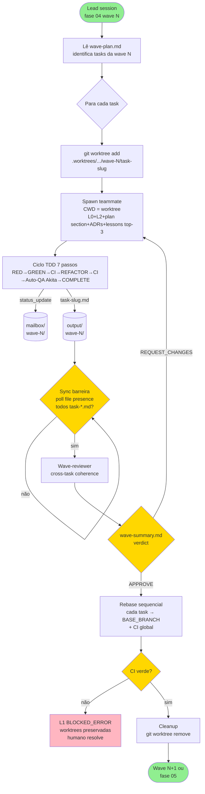

# Agent Team Protocol

> **Versão:** v3.0.0-beta1
> **Skill:** `xp-icm-workflow`
> **Propósito:** Doc canônico do protocolo Agent Team usado **exclusivamente** na fase 04 `implementation_waves`. Lead session orquestra N teammates Claude Code, cada um isolado em seu próprio git worktree, executando tasks da wave em paralelo. Esta referência define spawn, comunicação, sincronização, review e cleanup.

> **Decisão de origem:** Q2/Q7/Q17 + §4.2-4.4 do plan `reescrever-a-skill-zazzy-wirth.md`, ajustes E3/E4/F-A em adversariais.

---

## 1. Quando usar Agent Team (vs sessão única sequencial)

Cap teammates por wave por **tier** (Q17):

| Tier | Cap |
|---|---|
| experimental | 2 |
| tool | 3 |
| development | 5 |
| production | 5 |

**Skip Agent Team** (rodar sequencial single-agent na fase 04) quando:

- `tier=experimental` E ≤2 tasks na wave.
- `tier=tool` E 1 task na wave.
- `profile=experiment` (override pela matriz).

Mecanismo por fase (plan §4.2):

| Fases | Mecanismo |
|---|---|
| 00-3 (recon, discovery, design, wave_planner) | Sessão única humano-Claude |
| 04 (implementation_waves) | **Agent Team** (3-5 teammates por wave) |
| 05-7 (verification, review, merge) | Sessão única ou subagent simples |
| 08 (feedback intake) | Sessão única manual |

Profile pode override cap (Q17 D''') — `framework_library` e `ml_project` cap=3.

---

## 2. Spawn de teammates pelo lead

Lead session na fase 04:

1. Lê `stages/03_wave_planner/output/wave-plan.md` (gerado pela fase 03).
2. Identifica wave atual (`L1.waves.current`).
3. Para cada task da wave:
   - Cria git worktree isolado.
   - Spawn teammate via Task tool com prompt fixo carregando contexto pré-cozinhado.
4. CWD do teammate = path do worktree (vide L0 §2 CWD do agente).

### 2.1 Prompt fixo do teammate

Lead injeta inline no spawn:

- L0 (`workspaces/{{WORKSPACE}}/CLAUDE.md`).
- L2 da fase 04 (`workspaces/{{WORKSPACE}}/stages/04_implementation_waves/CONTEXT.md`).
- Seção da task no `plan.md` (4-block + metadados).
- ADRs listados em `Files touched` da task.
- Lições críticas pré-extraídas (top-3 via Q10 match, severity desc).
- `4-block-contract-template.md` (ciclo TDD 7 passos canônico).

Teammate **NÃO** lê `lessons.md` cru — lead pré-cozinha (§4.11 plan).

### 2.2 Sintaxe git worktree

Criação:

```bash
git -C {{PROJECT_ROOT}} worktree add \
  {{PROJECT_ROOT}}/.worktrees/workspace-{{WORKSPACE}}/wave-<N>/<task-slug> \
  -b wave-{{WORKSPACE}}-<N>/<task-slug> \
  {{BASE_BRANCH}}
```

Cleanup ao fim da wave (após rebase em `{{BASE_BRANCH}}`):

```bash
git -C {{PROJECT_ROOT}} worktree remove \
  {{PROJECT_ROOT}}/.worktrees/workspace-{{WORKSPACE}}/wave-<N>/<task-slug>
```

`.worktrees/` é gitignored (vide A3). Pre-flight da próxima wave verifica `.worktrees/workspace-{{WORKSPACE}}/` vazio.

---

## 3. Mailbox por wave

Diretório de mensagens entre lead ↔ teammates ↔ peer-reviewer:

```
{{PROJECT_ROOT}}/workspaces/{{WORKSPACE}}/stages/04_implementation_waves/output/wave-<N>/mailbox/
```

### 3.1 Schema da mensagem

```markdown
---
from: <lead | teammate-<slug> | peer-reviewer-<slug>>
to: <lead | teammate-<slug> | peer-reviewer-<slug>>
at: <ISO-8601>
type: status_update | blocked | request_review | review_complete | reduce_signal
---

# Conteúdo da mensagem

<corpo livre, markdown>
```

### 3.2 Filename

`<at>-<from>-<to>-<type>.md` (timestamp-prefixed para ordenação cronológica).

Exemplo: `2026-04-25T14:32:10-teammate-auth-middleware-lead-status_update.md`.

### 3.3 Tipos canônicos

| Tipo | Disparado por | Lido por |
|---|---|---|
| `status_update` | teammate | lead (poll) |
| `blocked` | teammate (cap 3 ciclos OU stop point) | lead (escala humano) |
| `request_review` | lead | peer-reviewer |
| `review_complete` | peer-reviewer | lead, teammate principal |
| `reduce_signal` | lead | teammates (mid-wave reduce, vide §9) |

---

## 4. Sync barreira explícita

Problema do v2.4 (bug B6 do plan): sync implícita, lead não esperava todos COMPLETE.

**Mecanismo determinístico:**

Lead poll ativo sobre dois sinais:

1. Existência de `output/wave-<N>/task-<slug>.md` (artefato final do passo 7 do TDD ciclo).
2. Mailbox `*-status_update-*.md` com último status `COMPLETE`.

Pseudo-algoritmo:

```python
expected_tasks = {t.slug for t in wave.tasks}
output_dir = workspace / "stages/04_implementation_waves/output"
deadline = now() + timedelta(hours=1)  # hard timeout por wave

while now() < deadline:
    completed = {
        f.stem.removeprefix("task-")
        for f in (output_dir / f"wave-{N}").glob("task-*.md")
    }
    if completed >= expected_tasks:
        break
    sleep(30)  # poll a cada 30s
else:
    # timeout → lead escala humano via mailbox
    raise WaveTimeout(...)
```

Sync barreira **NÃO é polling de status verbal** — é confirmação de file presence determinística.

---

## 5. Wave-reviewer

Após sync barreira, lead spawn **1 teammate dedicado** `wave-reviewer-<N>` para cross-task coherence check.

Wave-reviewer **NÃO** revalida código de cada task (isso já passou no auto-QA Akita §6 do TDD ciclo). Verifica:

- Outputs declarados em `Files touched` de cada task **existem** no merge final da wave.
- Inter-task dependencies funcionam (smoke test entre módulos da wave).
- Conventions consistentes entre tasks (naming, padrões, error handling).

Output: `output/wave-<N>/wave-summary.md`.

Verdict: `APPROVE` | `REQUEST_CHANGES`.

### 5.1 Skip exception (F2)

Wave com **1 task** pula wave-reviewer. CI global cobre. Documentado em `wave-planner-algorithm.md`.

---

## 6. Rebase sequencial

Após wave-reviewer `APPROVE`, lead executa rebase em ordem topológica das tasks:

```bash
for task in wave.tasks_in_dependency_order:
    git -C {{PROJECT_ROOT}} checkout {{BASE_BRANCH}}
    git rebase wave-{{WORKSPACE}}-<N>/<task-slug>

    # CI gate global
    if ci_fails:
        # E4: worktrees PRESERVADAS, status BLOCKED_ERROR
        git rebase --abort
        L1.status = "BLOCKED_ERROR"
        L1.blocked_at_subwave = N
        L1.blocked_task = task.slug
        # escala humano via mailbox + para
        return
```

Conflito de rebase = humano resolve (não auto-solve). Worktrees não-rebaseadas ficam intactas. Lead retoma do task bloqueado em sessão futura.

---

## 7. CI global entre waves

Wave N+1 só inicia após:

1. Wave N inteiramente mergeada em `{{BASE_BRANCH}}`.
2. CI global verde (testes integrados — não só por-task).
3. Cleanup de `.worktrees/workspace-{{WORKSPACE}}/wave-<N>/` executado.

Pre-flight check da próxima wave valida os 3 itens.

---

## 8. Diagrama de fluxo



---

## 9. Mid-wave reduce (D'')

Lead pode reduzir cap **mid-wave** quando observa drift. Triggers:

- **Ciclos travados:** 3 voltas sem convergir em algum teammate (auto-QA Akita falhando 3× — vide cap §3.1 do 4-block-contract-template).
- **Idle waiting:** ≥2 teammates em status `IN_PROGRESS` sem update há ≥30min.
- **Orçamento crescendo:** tokens consumidos > 2× estimativa (vide §11).

### 9.1 Ação

1. Lead encerra wave parcial: tasks já COMPLETE permanecem; tasks não-completas viram `BLOCKED`.
2. Snapshot pra humano em `output/wave-<N>/mid-wave-reduce.md` (descreve quais tasks completaram, quais não, razão do reduce).
3. Lead atualiza L1:
   - `status: BLOCKED_ERROR`
   - `last_action: "mid-wave reduce — N teammates encerrados precocemente"`
4. Sinaliza teammates restantes via mailbox `reduce_signal`.

### 9.2 Decisão humana

Humano escolhe (menu A/B/C):

- **(A)** continuar com tasks restantes em sub-wave seguinte.
- **(B)** repensar `plan.md` (volta fase 02).
- **(C)** abortar wave inteira.

---

## 10. Peer-reviewer ad-hoc (F-A, tier=production)

Para tasks `Requires_peer_review: true`, opcional segundo teammate `peer-reviewer-<slug>` faz review independente APÓS o teammate principal sinalizar COMPLETE.

### 10.1 Triggers

- Path crítico (definido em `plan.md` por task: `Requires_peer_review: true`).
- 3 ciclos travados no teammate principal (cap atingido).
- Tier=production sempre (default).

### 10.2 Fluxo

1. Lead spawn `peer-reviewer-<slug>` em worktree separado (mesma branch wave que o principal, read-only).
2. Peer-reviewer lê `output/wave-<N>/task-<slug>.md` (relatório do teammate principal).
3. Faz review focada em **correctness**, **security**, **perf**.
4. Escreve `output/wave-<N>/peer-review-<slug>.md`.
5. Comunica via mailbox: tipo `review_complete`. Verdict:
   - `APPROVE` → lead procede sync barreira.
   - `REQUEST_FIX` → teammate principal recebe via mailbox + entra em **novo ciclo** (cap 3 ainda vigente).

---

## 11. Token budget alvo (plan §4.10)

Referência (sem enforcement automático — vide Q19):

| Papel | Tokens típicos |
|---|---|
| Lead (orquestração) | ~1k |
| Teammate (cada) | ~5-8k |
| Wave-reviewer | ~3k |
| Peer-reviewer (ad-hoc) | ~3k |

Wave de 5 teammates ≈ 30-50k tok totais. `>2× estimativa` dispara mid-wave reduce (§9).

---

## 12. Validação automatizada (Wave 4 da skill)

- `tests/integration/test_worktrees.bats` cobre git worktree create/remove ciclos + branch isolation.
- `scripts/agent-team-protocol.py` (sibling) expõe helpers consumidos pelo lead:
  - `spawn_worktree(workspace, wave_n, task_slug, base_branch)` → path
  - `cleanup_worktree(workspace, wave_n, task_slug)` → idempotente
  - `mailbox_dir(workspace, wave_n)` → path
  - `sync_barrier_check(workspace, wave_n, expected_tasks)` → bool

---

## 13. Referências cruzadas

| Doc | Conteúdo relacionado |
|---|---|
| `references/4-block-contract-template.md` | Ciclo TDD 7 passos por teammate, auto-QA Akita 15-item, cap 3 |
| `references/wave-planner-algorithm.md` | DAG, sub-waves (E3), Q10 lesson match, Q6 peer-review trigger |
| `references/stage-templates.md` | L2 da fase 04 `implementation_waves` (Inputs/Outputs) |
| `references/state-machine-schema.md` | L1 status canônicos (BLOCKED_ERROR, RESTARTING_AT_PHASE_X) |
| `references/stop-points-canonical.md` | 12 stop points + escalonamento via mailbox |
| `references/recovery-wizard.md` | Recuperação se lead crashou mid-wave |
| `templates/workspace/CLAUDE.md.tpl` | L0 §2 CWD por agente (lead vs teammate) |
