# Example Run — End-to-end with subagents (xp-icm-workflow v3.0.0-beta5)

> **Version:** v3.0.0-beta5
> **Skill:** `xp-icm-workflow`
> **Purpose:** concrete walkthrough of a full workspace, from bootstrap to feedback intake. Fictional but realistic workspace. Shows what each session reads, writes, and how L1 transitions. Use as a mental anchor when running real cycles.

---

## Scenario

- **Project:** `aura-luz-api` (FastAPI backend for Loja Aura Luz)
- **Profile:** `app_web_backend`
- **Tier:** `development`
- **Feature:** `feat-auth` — JWT middleware with refresh token (no identity SaaS)
- **Workspace:** `042-feat-auth`
- **Project root:** `/repo/aura-luz-api`
- **Base branch:** `main`

---

## Diagram — session timeline

```mermaid
flowchart LR
    BOOT([Bootstrap<br/>one-shot]) --> S1[Session 1<br/>00 recon]
    S1 --> S2[Session 2<br/>01 discovery<br/>STOP paid_service]
    S2 --> S3[Session 3<br/>02 design<br/>1 new ADR]
    S3 --> S4[Session 4<br/>03 wave_planner<br/>DAG → 2 waves]
    S4 --> S5[Session 5<br/>04 wave 1<br/>2 parallel subagents]
    S5 --> S6[Session 6<br/>04 wave 2<br/>1 sequential subagent]
    S6 --> S7[Session 7<br/>05 verification]
    S7 --> S8[Session 8<br/>06 review<br/>0 P0/P1, 2 P3]
    S8 --> S9[Session 9<br/>07 merge<br/>direct to main]
    S9 -.->|2 weeks later| S10[Session 10<br/>08 feedback intake<br/>exit A close]

    style BOOT fill:#87CEEB
    style S1 fill:#B0E0E6
    style S2 fill:#FFB6C1
    style S3 fill:#B0E0E6
    style S4 fill:#B0E0E6
    style S5 fill:#DDA0DD
    style S6 fill:#DDA0DD
    style S7 fill:#B0E0E6
    style S8 fill:#B0E0E6
    style S9 fill:#90EE90
    style S10 fill:#FFFFE0
```



---

## Bootstrap — one-shot command

Guilherme opens a Claude Code session at the project root and runs:

```
/xp-icm-workflow profile=app_web_backend tier=development project-root=/repo/aura-luz-api workspace-name=feat-auth
```

**What bootstrap does (~500-1k tok):**

1. Pre-flight runtime check (`scripts/check-runtime.sh`): Python 3.13 ✓, PyYAML ✓, git 2.42 ✓, bash ✓.
2. Detects `.icm-profile.local.yaml` absent — uses CLI args.
3. Resolves profile + tier + override (empty) → `profile_effective_hash = 9f3a8b2c...`.
4. `git rev-parse --abbrev-ref HEAD` → `base_branch=main`.
5. Next workspace number: reads `workspaces/.index.md` (if it exists), finds next free slot → `042`.
6. Creates FS:
   ```
   /repo/aura-luz-api/workspaces/042-feat-auth/
   ├── CLAUDE.md                                    [L0 populated]
   ├── CONTEXT.md                                   [L1 initial]
   ├── stages/00..08/CONTEXT.md                     [9 L2 templates]
   ├── _config/profile-effective.yaml
   └── _references/superpowers-summary/             [11 200tok summaries]
   ```
7. `git checkout -b workspace/042-feat-auth`.
8. Installs `pre-commit` hook in `.git/hooks/pre-commit`.
9. Updates `.gitignore` (adds `.icm-profile.local.yaml`).
10. Initial commit: `chore(workspace): bootstrap 042-feat-auth (profile=app_web_backend tier=development)`.
11. Updates `workspaces/.index.md` with entry `042-feat-auth | active | 2026-04-25`.
12. Message to human: "Workspace 042-feat-auth bootstrapped. Open a new session to start stage 00 recon."
13. **Exits.**

Initial L1:

```yaml
---
workspace: "042-feat-auth"
profile_base: "app_web_backend"
profile_effective_hash: "9f3a8b2c4d6e1f7a8b9c0d1e2f3a4b5c6d7e8f9a0b1c2d3e4f5a6b7c8d9e0f1a"
tier: "development"
project_root: "/repo/aura-luz-api"
base_branch: "main"
workspace_branch: "workspace/042-feat-auth"
stage_atual: "00"
sub_stage: "00_in_progress"
status: "IN_PROGRESS"
iteration: 0
last_action: "bootstrap one-shot"
last_action_at: "2026-04-25T10:00:00Z"
next_action: "run stage 00 recon"
last_transition:
  from: null
  to: "00_in_progress"
  at: "2026-04-25T10:00:00Z"
  commit_sha: "0a0a0a0"
history:
  - at: "2026-04-25T10:00:00Z"
    event: "stage_transition"
    from: null
    to: "00_in_progress"
    commit_sha: "0a0a0a0"
    note: "bootstrap"
---
```

---

## Session 1 — stage 00 recon (~3k tok)

**Pre-flight:** reads L0 + L1 + L2 of stage 00. Validates runtime, branch, hash. All green.

**Work:**
- Detects existing repo (not greenfield): `git log --oneline | wc -l` → 1247 commits.
- Reads `docs/decisions/` if it exists → finds 3 active ADRs:
  - `0001-stack-fastapi-postgres.md`
  - `0002-auth-strategy-jwt.md` (already declares JWT but only access token)
  - `0003-deploy-docker-compose.md`
- Reads `docs/lessons.md` → 12 lessons; sample-check passes.
- Reads `docs/tech_debt.md` → 5 entries; none blocking.
- Writes `stages/00_recon/output/baseline.md`:
  - Current stack (Python 3.13, FastAPI 0.115, PostgreSQL 16, SQLAlchemy 2.x).
  - 3 active ADRs listed.
  - Relevant lessons filtered (5 of 12 tagged `auth` or `security`).
  - Tech debt items close to scope (1 item: "logger still uses print in src/auth/").

**Human gate:** "Stage 00 complete. Do you want to review baseline.md before proceeding?" — human approves.

**L1 transitions:**

```yaml
# diff
sub_stage: "00_in_progress" → "00_completed" → "01_in_progress"
status: "IN_PROGRESS"
last_action: "stage 00 complete, baseline.md written"
last_transition:
  from: "00_completed"
  to: "01_in_progress"
  at: "2026-04-25T10:30:00Z"
  commit_sha: "1a2b3c4"
history append:
  - event: "stage_transition", from: "00_completed", to: "01_in_progress", commit_sha: "1a2b3c4"
```

---

## Session 2 — stage 01 discovery (~5k tok, WITH stop point)

**Pre-flight:** OK.

**Work:**
- Consults `brainstorming-200tok.md` summary.
- Clarification session with human via 4-block.
- Presents 3 macro auth strategy options:
  - **A) Simple JWT** — access token only, 1h expiry. Simple, but no refresh.
  - **B) JWT + refresh token** — access 15min + refresh 7 days, rotation. Self-sovereign, no SaaS.
  - **C) OAuth2 delegated** — Auth0 or similar (paid SaaS).
- Upon detecting option C as possible, agent triggers stop point `paid_service`:
  - `tier=development` → `hard` mode, threshold R$ 500/month.
  - Auth0 free tier would cover it, but would exceed on growth.

**Stop point triggered:**

L1 becomes:

```yaml
status: "BLOCKED_STOP_POINT"
last_action: "stop point paid_service triggered (Auth0)"
history append:
  - event: "stop_point_triggered", stop_point_id: "paid_service", note: "Auth0 SaaS — scalable cost"
```

Output `stages/01_discovery/output/stop-paid-service-menu.md` (template §3 of `stop-points-canonical.md`):

```markdown
# 🛑 STOP POINT — paid_service (Auth0 SaaS for delegated auth)

## Summary
Option C (OAuth2 delegated via Auth0) implies paid SaaS.
Free tier covers up to 7k MAU; beyond that scales to R$ 500-2000/month.

## Trade-offs
- A) Simple JWT — self-sovereign, no cost, no refresh (worse UX).
- B) JWT + refresh — self-sovereign, no cost, medium complexity.
- C) Auth0 — excellent UX, scalable cost, lock-in.

## Reversibility
- A → B: trivial (adds refresh without rework).
- A → C: high cost (rework entire flow).
- C → A/B: very high (loses Auth0 features).

## Agent recommendation
**B (JWT + refresh).** Aura Luz values sovereignty (memory from feedback);
estimated volume <5k MAU in 12 months; medium complexity is absorbable
in 1 ADR + 3 tasks.

## Human action
Reply in chat: A / B / C / free text.

L1 updated: status=BLOCKED_STOP_POINT.
```

**Human replies:** "B".

L1 becomes:

```yaml
status: "IN_PROGRESS"
history append:
  - event: "stop_point_resolved", stop_point_id: "paid_service", resolution: "B"
```

Session writes `stages/01_discovery/output/discovery.md`:
- Audience: authenticated Aura Luz customers.
- MVP IN: JWT access (15min) + refresh (7d) + FastAPI middleware.
- MVP OUT: 2FA, OAuth, social login.
- Risks: refresh token rotation (sequence), cache invalidation.
- Metrics: latency <50ms p95 in middleware; 0% PII in logs.

**Human gate** approves → transitions to 02.

---

## Session 3 — stage 02 design (~6k tok)

**Pre-flight:** OK. Reads discovery.md, baseline.md, ADR 0001/0002, tech_debt.md.

**Work:**
- Consults `writing-plans-200tok.md`.
- Decision: ADR 0002 (JWT only) is outdated — supersede with new ADR.
- Writes `docs/decisions/0042-jwt-refresh-strategy.md` (status: accepted; supersedes: 0002).
- Updates `docs/decisions/0002-...` (status: superseded by 0042).
- Writes `stages/02_design/output/plan.md` with 3 tasks (4-block contract):
  - `jwt-utils` — sign/verify/decode funcs using `python-jose`.
  - `auth-middleware` — FastAPI dependency that validates access token.
  - `refresh-endpoint` — POST /auth/refresh, atomic rotation.
- Writes `stages/02_design/output/decisions.md` (INDEX of ADRs).

Schema of task `auth-middleware` (partial):

```markdown
## Task auth-middleware: JWT validation dependency

### Files touched
- src/auth/middleware.py
- src/auth/errors.py
- tests/auth/test_middleware.py

### ADRs aplicáveis
- docs/decisions/0001-stack-fastapi-postgres.md
- docs/decisions/0042-jwt-refresh-strategy.md

### Depends on
- jwt-utils
```

**Human gate** approves plan.md and ADR → transitions to 03.

---

## Session 4 — stage 03 wave_planner (~3k tok)

**Pre-flight:** OK.

**Work:**
- Runs `scripts/wave-planner-script.py --plan stages/02_design/output/plan.md --tier development --profile app_web_backend --workspace 042-feat-auth`.
- Deterministic pipeline (`references/wave-planner-algorithm.md`):
  - Parse: 3 tasks.
  - DAG: edges `(jwt-utils, auth-middleware)` and `(jwt-utils, refresh-endpoint)`. No file conflicts.
  - Topo: Wave 1 = `[jwt-utils]`. Wave 2 = `[auth-middleware, refresh-endpoint]`.
  - Cap = 5 (development), no sub-wave needed.
  - No ambiguities.
- Reflects: wave 1 with 1 task — can skip LLM review (skip threshold ≤2 tasks).
- Wave 2 with 2 tasks — invokes LLM review subagent. Verdict: `APPROVE` (explicit deps match semantics).
- Writes `stages/03_wave_planner/output/wave-plan.md` (schema §11 of algorithm doc).

**Stdout:**
```
total_tasks=3 total_waves=2 total_sub_waves=2 ambiguities=0
```

**Human gate** approves → transitions to 04 wave 1.

---

## Session 5 — stage 04 wave 1 (~6k tok lead + 1×6k subagent = 12k)

**Pre-flight:** OK. Lead reads wave-plan.md, identifies wave 1 = `[jwt-utils]`.

Wave 1 has **1 task** → simplified flow:

- Lead spawns 1 subagent via Task tool on branch `wave-042-feat-auth-1/jwt-utils`.
- Subagent runs 7-step TDD cycle:
  1. **RED:** `tests/auth/test_jwt_utils.py` with 6 tests (sign, verify, decode, expired, malformed, edge cases). Red.
  2. **GREEN:** `src/auth/jwt_utils.py` with 3 funcs. Green.
  3. **CI gate (1st):** ruff ✓ mypy ✓ pytest ✓.
  4. **REFACTOR:** extracts `_load_jwks()` helper.
  5. **CI gate (2nd):** green.
  6. **Auto-QA Akita:** 15 items, 1 cycle, ✅ all green.
  7. **COMPLETE:** writes `stages/04_implementation_waves/output/wave-1/task-jwt-utils.md`.

- Lead poll detects `task-jwt-utils.md` → sync barrier OK.
- Wave-reviewer **skip** (1 task, per F2 of `wave-planner-algorithm.md` §10).
- Lead sequential merge: `git merge wave-042-feat-auth-1/jwt-utils into main` → CI global green.

**L1 transitions:**

```yaml
# before
sub_stage: "04_wave_1_in_progress"
waves: { current: 1, completed: [], current_sub_wave: null, blocked_at_sub_wave: null, blocked_task: null }

# after
sub_stage: "04_wave_2_in_progress"
waves: { current: 2, completed: [1], ... }
last_action: "wave 1 merged into main, CI green"
history append:
  - event: "wave_completed", note: "wave 1 merged into main, CI green", commit_sha: "5d6e7f8"
  - event: "stage_transition", from: "04_wave_1_completed", to: "04_wave_2_in_progress", commit_sha: "5d6e7f8"
```

---

## Session 6 — stage 04 wave 2 (~1k lead + 2×7k subagents + 3k wave-reviewer = ~18k)

**Pre-flight:** OK. Lead identifies wave 2 = `[auth-middleware, refresh-endpoint]`.

- Lead spawns 2 subagents on isolated branches:
  - branch `wave-042-feat-auth-2/auth-middleware`.
  - branch `wave-042-feat-auth-2/refresh-endpoint`.
- Spawns 2 subagents **in parallel**, each with fixed prompt (4-block + ADRs + pre-cooked top-3 lessons).
- Each subagent runs 7-step TDD cycle.
- `auth-middleware`: 2 Akita cycles (1st round failed item 12, removed `logger.info(token)`; 2nd green).
- `refresh-endpoint`: 1 cycle, green directly.
- Lead sync barrier: polls every 30s until detecting `task-auth-middleware.md` + `task-refresh-endpoint.md`. ~12min total.
- Wave-reviewer runs (2 tasks > 1, NOT skipped). Verdict: `APPROVE` — coherence OK.
- Sequential merge in topological order (no deps between auth-middleware and refresh-endpoint, order by appearance in plan.md):
  - `git merge wave-042-feat-auth-2/auth-middleware into main` → CI green.
  - `git merge wave-042-feat-auth-2/refresh-endpoint into main` → CI green.

**L1 transitions:** sub_stage `04_wave_2_completed` → stage 05.

---

## Session 7 — stage 05 verification (~4k tok)

**Pre-flight:** OK.

**Work:**
- Consults `verification-before-completion-200tok.md`.
- Verifies:
  - CI global green on `main` (post-merge).
  - Coverage: `src/auth/` 94% (above minimum 90% for tier=development).
  - Conformance to plan.md: 3/3 tasks with VALIDAÇÃO met (sample-check of tests).
  - Conformance to ADRs: ADR 0042 implemented on all plan points.
- Writes `stages/05_verification/output/verification-report.md` with verdict `PASS`.

**L1 transitions:** `05_completed` → `06_in_progress`.

---

## Session 8 — stage 06 review (~5k tok)

**Work:**
- Consults `requesting-code-review-200tok.md`.
- Review on 7 dimensions:
  - **Correctness:** OK — tests cover golden + edges.
  - **Security:** OK — no PII in logs, JWT verify mandatory, secrets via env.
  - **Tests:** OK — coverage 94%, non-flaky in 50 runs.
  - **Design:** OK — clear separation middleware/utils/endpoint.
  - **Standards:** OK — follows `xp-conventions.md`.
  - **Readability:** OK — funcs ≤15 LOC, clear names.
  - **Performance:** OK — JWKS cached, p95 <30ms in local bench.
- Finds 2 P3 issues:
  - `src/auth/jwt_utils.py:42` — English comment mixed with Portuguese docstring (consistency).
  - `tests/auth/test_middleware.py:88` — fixture could be parameterized.
- 0 P0/P1 → no fix loop triggered.
- Writes `stages/06_review/output/review-report.md`.
- Appends 2 P3 items to `docs/tech_debt.md`.

**L1 transitions:** `06_completed` → `07_in_progress`.

---

## Session 9 — stage 07 merge (~2k tok)

**Work:**
- Consults `finishing-a-development-branch-200tok.md`.
- Presents human menu: (a) merge directly into `main`, (b) open PR for external review, (c) release tag.
- Human chooses (a) — main already received wave merges; nothing to do on the code.
- Session:
  - Updates `docs/lessons.md` with 1 new entry (linked to Akita cycle of auth-middleware: "logger.info can leak token; use logger with PII filter by default").
  - Writes `stages/07_merge/output/merge-report.md`.
  - Appends nothing new to `docs/tech_debt.md` (P3 already noted in session 8).
- L1 transitions to `COMPLETED`:

```yaml
# before
stage_atual: "07"
sub_stage: "07_in_progress"
status: "IN_PROGRESS"

# after
stage_atual: "07"
sub_stage: "07_completed"
status: "COMPLETED"
last_action: "stage 07 merge directly into main, lessons appended"
history append:
  - event: "stage_transition", from: "07_in_progress", to: "07_completed", commit_sha: "fff111"
```

- Updates `workspaces/.index.md` entry: `042-feat-auth | completed | 2026-04-25`.

**Workspace COMPLETED.** Estimated total: ~60k tokens in 9 sessions.

---

## 2 weeks later — Session 10: stage 08 feedback intake (~3k tok)

Human used the middleware in production for 14 days. Logs show:
- 1 incident: token expiry compared with `<=` instead of `<` caused edge case where token expired for 0ms still passed (caught in monitoring; was manually hotfixed outside the workspace).
- 0 other bugs.

Human opens new session and says: "run stage 08 for workspace 042".

**Pre-flight:** OK. Status `COMPLETED`, outputs 00-07 exist.

**Work:**
- Reads last 30 days of logs (`logs_root` declared in L0).
- Asks human (4-block):
  - **O QUE FUNCIONOU:** middleware stable, refresh rotation with no race observed.
  - **O QUE NÃO FUNCIONOU:** comparison `<=` on expiry (0ms edge case).
  - **QUAL DOR PERSISTE:** none; hotfix resolved it.
  - **QUE LIÇÃO TIRAR:** "timestamp comparisons for expiry must always use strict `<`; `<=` allows just-expired tokens".
- Top-N patterns: 1 pattern (boundary off-by-one in time comparison).
- Writes `stages/08_feedback_intake/output/intake-report.md` with recommendation: **exit A (close)**.

**Human confirms A.**

L1 transitions:

```yaml
# before
sub_stage: "07_completed"
status: "COMPLETED"

# after
sub_stage: "08_decided_A"
status: "COMPLETED"
last_action: "stage 08 exit A — close workspace"
last_transition:
  from: "08_in_progress"
  to: "08_decided_A"
  at: "2026-05-09T15:00:00Z"
  commit_sha: "deadbeef"
history append:
  - event: "stage_transition", from: "07_completed", to: "08_in_progress", commit_sha: "...", at: "2026-05-09T14:30:00Z"
  - event: "stage_transition", from: "08_in_progress", to: "08_decided_A", commit_sha: "deadbeef", note: "tool works, 1 lesson captured"
```

`docs/lessons.md` receives new entry:

```yaml
- id: "0021"
  date: "2026-05-09"
  tags: ["auth", "time", "off-by-one"]
  severity: "high"
  text: "timestamp comparisons for token expiry must always use strict <; <= allows just-expired tokens (Aura Luz auth middleware, 0ms edge case detected in production, workspace 042-feat-auth)"
```

`workspaces/.index.md` updated: `042-feat-auth | closed | 2026-05-09`.

**Total effective human time:**
- Bootstrap: 2min
- Sessions 1-9: ~3-5h in ≤9 exchanges (each session is discrete, human interacts only at gates).
- Session 10 (2 weeks later): ~15min.

**Total estimated tokens:** ~65k (full project: bootstrap + cycle + feedback).

---

## Anti-patterns observed (avoid)

- ❌ Lead in stage 04 opens `src/auth/middleware.py` "just to take a look" — lead reads ONLY `task-<slug>.md` reports and `wave-summary.md`.
- ❌ Session skips `pre-flight check` from L2 claiming "it's obvious, last commit was mine" — pre-flight detects drift even in consecutive sessions.
- ❌ Human asks "use Auth0" in chat without having approved the stop point — session must refuse and rebuild the A/B/C menu with the new preference recorded.
- ❌ Subagent in stage 04 reads `docs/lessons.md` raw (lead pre-cooks top-3 inline; subagent does NOT consult lessons directly).
- ❌ Trying to invoke `Skill({skill:"superpowers:writing-plans"})` in stage 02 without registering `skill_escape_hatch` in L1 history — breaks audit.

---

## v3.5.0 — additional fields in stage 04 walkthrough

Workspaces v3.5.0+ add to L1 history and task reports:

- **L1 history event `wave_started`:** includes `pre_wave_sha: <BASE_BRANCH HEAD sha>` captured in step 1. Used by `references/ci-rollback-protocol.md` as reset point if CI global red.
- **Task report frontmatter:** subagent records `qa_loops_used: <N>` (Akita Auto-QA loop counter) + `auto_qa_passed: <bool>` (final decision). Wave-reviewer audits against git log of the wave branch (anti-fraud).
- **New canonical status:** `BLOCKED_HITL` — mixed wave with 1+ `type: HITL` task awaiting human (not a failure). Distinct from `BLOCKED_ERROR`.
- **Pre-merge sort buffer:** lead buffers `{task_slug: agent_result}`; sequential merge uses order from `plan.md > tasks[]`, not Agent return order.

The other stages (00-03, 05-08) remain identical to the walkthrough above.

## Cross-references

| Doc | Related content |
|---|---|
| `references/state-machine-schema.md` | Full L1 schema (yaml frontmatter + history) |
| `references/stage-templates.md` | Spec of the 9 L2 templates |
| `references/stop-points-canonical.md` | 12 stop points + thresholds (paid_service §1.1) |
| `references/wave-planner-algorithm.md` | DAG construction + LLM review subagent |
| `references/subagent-protocol.md` | Spawn, Agent tool output, sync barrier, wave-reviewer |
| `references/wave-execution-protocol.md` | Canonical 12-step pipeline (v3.5.0) |
| `references/conflict-resolution-protocol.md` | Conflict mid-wave (human gate A/B/C) |
| `references/ci-rollback-protocol.md` | CI global red (diagnose → rollback → gate) |
| `references/4-block-contract-template.md` | Task schema in plan.md + 7-step TDD cycle + Akita 15-item |
| `references/feedback-intake-fase08.md` | Stage 08 detailed (3 exits A/B/C) |
| `references/v2.4-snapshot/example-run.md` | Previous v2.4 version (isolated stage 02→03 transition) |
| `SKILL.md` | Bootstrap CLI + Division of Responsibilities |
