# Example Run — End-to-end com Agent Teams (xp-icm-workflow v3.0.0-beta1)

> **Versão:** v3.0.0-beta1
> **Skill:** `xp-icm-workflow`
> **Propósito:** walkthrough concreto de um workspace inteiro, do bootstrap ao feedback intake. Workspace fictício mas realista. Mostra o que cada sessão lê, escreve e como L1 transita. Use como âncora mental ao executar ciclos reais.

---

## Cenário

- **Projeto:** `aura-luz-api` (FastAPI backend para a Loja Aura Luz)
- **Profile:** `app_web_backend`
- **Tier:** `development`
- **Feature:** `feat-auth` — middleware JWT com refresh token (sem SaaS de identidade)
- **Workspace:** `042-feat-auth`
- **Project root:** `/repo/aura-luz-api`
- **Base branch:** `main`

---

## Diagrama — linha do tempo das sessões

```mermaid
flowchart LR
    BOOT([Bootstrap<br/>one-shot]) --> S1[Sessão 1<br/>00 recon]
    S1 --> S2[Sessão 2<br/>01 discovery<br/>STOP paid_service]
    S2 --> S3[Sessão 3<br/>02 design<br/>1 ADR novo]
    S3 --> S4[Sessão 4<br/>03 wave_planner<br/>DAG → 2 waves]
    S4 --> S5[Sessão 5<br/>04 wave 1<br/>2 teammates paralelos]
    S5 --> S6[Sessão 6<br/>04 wave 2<br/>1 teammate seq]
    S6 --> S7[Sessão 7<br/>05 verification]
    S7 --> S8[Sessão 8<br/>06 review<br/>0 P0/P1, 2 P3]
    S8 --> S9[Sessão 9<br/>07 merge<br/>direto em main]
    S9 -.->|2 semanas depois| S10[Sessão 10<br/>08 feedback intake<br/>saída A close]

    style BOOT fill:#87CEEB
    style S1 fill:#B0E0E6
    style S2 fill:#FFB6C1
    style S3 fill:#B0E0E6
    style S4 fill:#B0E0E6
    style S5 fill:#DDA0DD
    style S6 fill:#DDA0DD
    style S7 fill:#B0E0E6
    style S8 fill:#B0E0E6
    style S9 fill:#90EE90
    style S10 fill:#FFFFE0
```



---

## Bootstrap — comando one-shot

Guilherme abre sessão Claude Code no project root e executa:

```
/xp-icm-workflow profile=app_web_backend tier=development project-root=/repo/aura-luz-api workspace-name=feat-auth
```

**O que o bootstrap faz (~500-1k tok):**

1. Pre-flight runtime check (`scripts/check-runtime.sh`): Python 3.13 ✓, PyYAML ✓, git 2.42 ✓, bash ✓.
2. Detecta `.icm-profile.local.yaml` ausente — usa CLI args.
3. Resolve profile + tier + override (vazio) → `profile_effective_hash = 9f3a8b2c...`.
4. `git rev-parse --abbrev-ref HEAD` → `base_branch=main`.
5. Próximo workspace number: lê `workspaces/.index.md` (se existir), encontra próximo livre → `042`.
6. Cria FS:
   ```
   /repo/aura-luz-api/workspaces/042-feat-auth/
   ├── CLAUDE.md                                    [L0 preenchido]
   ├── CONTEXT.md                                   [L1 inicial]
   ├── stages/00..08/CONTEXT.md                     [9 L2 templates]
   ├── _config/profile-effective.yaml
   └── _references/superpowers-summary/             [11 sumários 200tok]
   ```
7. `git checkout -b workspace/042-feat-auth`.
8. Instala `pre-commit` hook em `.git/hooks/pre-commit`.
9. Atualiza `.gitignore` (adiciona `.worktrees/`, `.icm-profile.local.yaml`).
10. Commit inicial: `chore(workspace): bootstrap 042-feat-auth (profile=app_web_backend tier=development)`.
11. Atualiza `workspaces/.index.md` com entry `042-feat-auth | active | 2026-04-25`.
12. Mensagem ao humano: "Workspace 042-feat-auth bootstrapped. Abra nova sessão para iniciar estágio 00 recon."
13. **Sai.**

L1 inicial:

```yaml
---
workspace: "042-feat-auth"
profile_base: "app_web_backend"
profile_effective_hash: "9f3a8b2c4d6e1f7a8b9c0d1e2f3a4b5c6d7e8f9a0b1c2d3e4f5a6b7c8d9e0f1a"
tier: "development"
project_root: "/repo/aura-luz-api"
base_branch: "main"
workspace_branch: "workspace/042-feat-auth"
stage_atual: "00"
sub_stage: "00_in_progress"
status: "IN_PROGRESS"
iteration: 0
last_action: "bootstrap one-shot"
last_action_at: "2026-04-25T10:00:00Z"
next_action: "rodar estágio 00 recon"
last_transition:
  from: null
  to: "00_in_progress"
  at: "2026-04-25T10:00:00Z"
  commit_sha: "0a0a0a0"
history:
  - at: "2026-04-25T10:00:00Z"
    event: "stage_transition"
    from: null
    to: "00_in_progress"
    commit_sha: "0a0a0a0"
    note: "bootstrap"
---
```

---

## Sessão 1 — estágio 00 recon (~3k tok)

**Pre-flight:** lê L0 + L1 + L2 do estágio 00. Valida runtime, branch, hash. Tudo verde.

**Trabalho:**
- Detecta repo existente (não greenfield): `git log --oneline | wc -l` → 1247 commits.
- Lê `docs/decisions/` se existir → encontra 3 ADRs vigentes:
  - `0001-stack-fastapi-postgres.md`
  - `0002-auth-strategy-jwt.md` (já declara JWT mas só access token)
  - `0003-deploy-docker-compose.md`
- Lê `docs/lessons.md` → 12 lessons; sample-check passa.
- Lê `docs/tech_debt.md` → 5 entries; nenhum bloqueante.
- Escreve `stages/00_recon/output/baseline.md`:
  - Stack atual (Python 3.13, FastAPI 0.115, PostgreSQL 16, SQLAlchemy 2.x).
  - 3 ADRs vigentes listados.
  - Lessons relevantes filtradas (5 das 12 com tag `auth` ou `security`).
  - Tech debt items próximos do escopo (1 item: "logger ainda usa print em src/auth/").

**Gate humano:** "Estágio 00 completo. Quer revisar baseline.md antes de seguir?" — humano aprova.

**L1 transita:**

```yaml
# diff
sub_stage: "00_in_progress" → "00_completed" → "01_in_progress"
status: "IN_PROGRESS"
last_action: "estágio 00 completo, baseline.md escrito"
last_transition:
  from: "00_completed"
  to: "01_in_progress"
  at: "2026-04-25T10:30:00Z"
  commit_sha: "1a2b3c4"
history append:
  - event: "stage_transition", from: "00_completed", to: "01_in_progress", commit_sha: "1a2b3c4"
```

---

## Sessão 2 — estágio 01 discovery (~5k tok, COM stop point)

**Pre-flight:** OK.

**Trabalho:**
- Consulta sumário `brainstorming-200tok.md`.
- Sessão de clarificação com humano via 4-block.
- Apresenta 3 opções macro de auth strategy:
  - **A) Simple JWT** — só access token, 1h expiry. Simples, mas sem refresh.
  - **B) JWT + refresh token** — access 15min + refresh 7 dias, rotação. Soberano, sem SaaS.
  - **C) OAuth2 delegated** — Auth0 ou similar (SaaS pago).
- Ao detectar opção C como possível, agente dispara stop point `paid_service`:
  - `tier=development` → modo `hard`, threshold R$ 500/mês.
  - Auth0 free tier suportaria, mas ao crescer ultrapassa.

**Stop point disparado:**

L1 vira:

```yaml
status: "BLOCKED_STOP_POINT"
last_action: "stop point paid_service disparado (Auth0)"
history append:
  - event: "stop_point_triggered", stop_point_id: "paid_service", note: "Auth0 SaaS — custo escalável"
```

Output `stages/01_discovery/output/stop-paid-service-menu.md` (template §3 de `stop-points-canonical.md`):

```markdown
# 🛑 STOP POINT — paid_service (Auth0 SaaS para auth delegated)

## Resumo
Opção C (OAuth2 delegated via Auth0) implica SaaS pago.
Free tier cobre até 7k MAU; passando disso escala para R$ 500-2000/mês.

## Trade-offs
- A) Simple JWT — soberano, sem custo, sem refresh (UX pior).
- B) JWT + refresh — soberano, sem custo, complexidade média.
- C) Auth0 — UX excelente, custo escalável, lock-in.

## Reversibilidade
- A → B: trivial (adiciona refresh sem refazer).
- A → C: alto custo (refazer fluxo inteiro).
- C → A/B: muito alto (perde features Auth0).

## Recomendação do agente
**B (JWT + refresh).** Aura Luz preza soberania (memoria de feedback);
volume estimado <5k MAU em 12 meses; complexidade média é absorvível
em 1 ADR + 3 tasks.

## Ação humano
Responda no chat: A / B / C / texto livre.

L1 atualizado: status=BLOCKED_STOP_POINT.
```

**Humano responde:** "B".

L1 vira:

```yaml
status: "IN_PROGRESS"
history append:
  - event: "stop_point_resolved", stop_point_id: "paid_service", resolution: "B"
```

Sessão escreve `stages/01_discovery/output/discovery.md`:
- Público: clientes Aura Luz autenticados.
- MVP IN: JWT access (15min) + refresh (7d) + middleware FastAPI.
- MVP OUT: 2FA, OAuth, social login.
- Riscos: rotação de refresh token (sequência), cache invalidation.
- Métricas: latência <50ms p95 no middleware; 0% PII em logs.

**Gate humano** aprova → transition para 02.

---

## Sessão 3 — estágio 02 design (~6k tok)

**Pre-flight:** OK. Lê discovery.md, baseline.md, ADR 0001/0002, tech_debt.md.

**Trabalho:**
- Consulta `writing-plans-200tok.md`.
- Decisão: ADR 0002 (JWT only) está desatualizado — superseder com novo ADR.
- Escreve `docs/decisions/0042-jwt-refresh-strategy.md` (status: accepted; supersedes: 0002).
- Atualiza `docs/decisions/0002-...` (status: superseded by 0042).
- Escreve `stages/02_design/output/plan.md` com 3 tasks (4-block contract):
  - `jwt-utils` — funcs de sign/verify/decode usando `python-jose`.
  - `auth-middleware` — dependency FastAPI que valida access token.
  - `refresh-endpoint` — POST /auth/refresh, rotação atomica.
- Escreve `stages/02_design/output/decisions.md` (INDEX dos ADRs).

Schema da task `auth-middleware` (parcial):

```markdown
## Task auth-middleware: JWT validation dependency

### Files touched
- src/auth/middleware.py
- src/auth/errors.py
- tests/auth/test_middleware.py

### ADRs aplicáveis
- docs/decisions/0001-stack-fastapi-postgres.md
- docs/decisions/0042-jwt-refresh-strategy.md

### Depends on
- jwt-utils
```

**Gate humano** aprova plan.md e ADR → transition para 03.

---

## Sessão 4 — estágio 03 wave_planner (~3k tok)

**Pre-flight:** OK.

**Trabalho:**
- Roda `scripts/wave-planner-script.py --plan stages/02_design/output/plan.md --tier development --profile app_web_backend --workspace 042-feat-auth`.
- Pipeline determinístico (`references/wave-planner-algorithm.md`):
  - Parse: 3 tasks.
  - DAG: arestas `(jwt-utils, auth-middleware)` e `(jwt-utils, refresh-endpoint)`. Sem file conflicts.
  - Topo: Wave 1 = `[jwt-utils]`. Wave 2 = `[auth-middleware, refresh-endpoint]`.
  - Cap = 5 (development), nenhum sub-wave necessário.
  - Sem ambiguidades.
- Reflete: wave 1 com 1 task — pode pular LLM review (skip threshold ≤2 tasks).
- Wave 2 com 2 tasks — invoca LLM review subagent. Verdict: `APPROVE` (deps explícitas batem com semântica).
- Escreve `stages/03_wave_planner/output/wave-plan.md` (schema §11 do algorithm doc).

**Stdout:**
```
total_tasks=3 total_waves=2 total_sub_waves=2 ambiguities=0
```

**Gate humano** aprova → transition para 04 wave 1.

---

## Sessão 5 — estágio 04 wave 1 (~6k tok lead + 1×6k teammate = 12k)

**Pre-flight:** OK. Lead lê wave-plan.md, identifica wave 1 = `[jwt-utils]`.

Wave 1 tem **1 task** → fluxo simplificado:

- Lead spawn 1 teammate via Task tool em worktree `/repo/aura-luz-api/.worktrees/workspace-042-feat-auth/wave-1/jwt-utils`.
- Branch: `wave-042-feat-auth-1/jwt-utils`.
- Teammate roda ciclo TDD 7 passos:
  1. **RED:** `tests/auth/test_jwt_utils.py` com 6 tests (sign, verify, decode, expired, malformed, edge cases). Vermelho.
  2. **GREEN:** `src/auth/jwt_utils.py` com 3 funcs. Verde.
  3. **CI gate (1ª):** ruff ✓ mypy ✓ pytest ✓.
  4. **REFACTOR:** extrai `_load_jwks()` helper.
  5. **CI gate (2ª):** verde.
  6. **Auto-QA Akita:** 15 itens, 1 ciclo, ✅ all green.
  7. **COMPLETE:** escreve `stages/04_implementation_waves/output/wave-1/task-jwt-utils.md`.

- Lead poll detecta `task-jwt-utils.md` → sync barreira OK.
- Wave-reviewer **skip** (1 task, conforme F2 de `wave-planner-algorithm.md` §10).
- Lead rebase sequencial: `git rebase wave-042-feat-auth-1/jwt-utils main` → CI global verde.
- Cleanup worktree.

**L1 transita:**

```yaml
# antes
sub_stage: "04_wave_1_in_progress"
waves: { current: 1, completed: [], current_sub_wave: null, blocked_at_sub_wave: null, blocked_task: null }

# depois
sub_stage: "04_wave_2_in_progress"
waves: { current: 2, completed: [1], ... }
last_action: "wave 1 merged em main, CI verde"
history append:
  - event: "wave_completed", note: "wave 1 merged em main, CI green", commit_sha: "5d6e7f8"
  - event: "stage_transition", from: "04_wave_1_completed", to: "04_wave_2_in_progress", commit_sha: "5d6e7f8"
```

---

## Sessão 6 — estágio 04 wave 2 (~1k lead + 2×7k teammates + 3k wave-reviewer = ~18k)

**Pre-flight:** OK. Lead identifica wave 2 = `[auth-middleware, refresh-endpoint]`.

- Lead cria 2 worktrees:
  - `.worktrees/.../wave-2/auth-middleware/` (branch `wave-042-feat-auth-2/auth-middleware`).
  - `.worktrees/.../wave-2/refresh-endpoint/` (branch `wave-042-feat-auth-2/refresh-endpoint`).
- Spawn 2 teammates **em paralelo**, cada um com prompt fixo (4-block + ADRs + lessons top-3 pré-cozinhadas).
- Cada teammate roda ciclo TDD 7 passos.
- `auth-middleware`: 2 ciclos Akita (1ª volta falhou item 12, removeu `logger.info(token)`; 2ª verde).
- `refresh-endpoint`: 1 ciclo, verde direto.
- Lead sync barreira: poll a cada 30s até detectar `task-auth-middleware.md` + `task-refresh-endpoint.md`. ~12min total.
- Wave-reviewer roda (2 tasks > 1, NÃO pula). Verdict: `APPROVE` — coherence OK.
- Rebase sequencial em ordem topológica (sem deps entre auth-middleware e refresh-endpoint, ordem por aparição em plan.md):
  - `git rebase wave-042-feat-auth-2/auth-middleware main` → CI verde.
  - `git rebase wave-042-feat-auth-2/refresh-endpoint main` → CI verde.
- Cleanup worktrees.

**L1 transita:** sub_stage `04_wave_2_completed` → estágio 05.

---

## Sessão 7 — estágio 05 verification (~4k tok)

**Pre-flight:** OK.

**Trabalho:**
- Consulta `verification-before-completion-200tok.md`.
- Verifica:
  - CI global verde em `main` (post-rebase).
  - Coverage: `src/auth/` 94% (acima do mínimo 90% de tier=development).
  - Conformidade ao plan.md: 3/3 tasks com VALIDAÇÃO atendida (sample-check de tests).
  - Conformidade aos ADRs: ADR 0042 implementado em todos os pontos do plan.
- Escreve `stages/05_verification/output/verification-report.md` com verdict `PASS`.

**L1 transita:** `05_completed` → `06_in_progress`.

---

## Sessão 8 — estágio 06 review (~5k tok)

**Trabalho:**
- Consulta `requesting-code-review-200tok.md`.
- Review nas 7 dimensões:
  - **Correctness:** OK — testes cobrem golden + edges.
  - **Security:** OK — sem PII em logs, JWT verify obrigatório, secrets via env.
  - **Tests:** OK — coverage 94%, não-flaky em 50 runs.
  - **Design:** OK — separação clara middleware/utils/endpoint.
  - **Standards:** OK — segue `xp-conventions.md`.
  - **Readability:** OK — funcs ≤15 LOC, nomes claros.
  - **Performance:** OK — JWKS cacheado, p95 <30ms em bench local.
- Encontra 2 issues P3:
  - `src/auth/jwt_utils.py:42` — comment inglês mistura com docstring português (consistency).
  - `tests/auth/test_middleware.py:88` — fixture poderia ser parametrizada.
- 0 P0/P1 → não dispara fix loop.
- Escreve `stages/06_review/output/review-report.md`.
- Append em `docs/tech_debt.md` os 2 P3.

**L1 transita:** `06_completed` → `07_in_progress`.

---

## Sessão 9 — estágio 07 merge (~2k tok)

**Trabalho:**
- Consulta `finishing-a-development-branch-200tok.md`.
- Apresenta menu humano: (a) merge direto em `main`, (b) abrir PR para review externo, (c) tag de release.
- Humano escolhe (a) — main já recebeu rebases das waves; nada a fazer no código.
- Sessão:
  - Atualiza `docs/lessons.md` com 1 entry nova (vinculada ao ciclo Akita do auth-middleware: "logger.info pode vazar token; usar logger com filter de PII por default").
  - Escreve `stages/07_merge/output/merge-report.md`.
  - Append `docs/tech_debt.md` com nada novo (P3 já anotados na sessão 8).
- L1 transita para `COMPLETED`:

```yaml
# antes
stage_atual: "07"
sub_stage: "07_in_progress"
status: "IN_PROGRESS"

# depois
stage_atual: "07"
sub_stage: "07_completed"
status: "COMPLETED"
last_action: "fase 07 merge direto em main, lessons appended"
history append:
  - event: "stage_transition", from: "07_in_progress", to: "07_completed", commit_sha: "fff111"
```

- Atualiza `workspaces/.index.md` entry: `042-feat-auth | completed | 2026-04-25`.

**Workspace COMPLETED.** Total estimado: ~60k tokens em 9 sessões.

---

## 2 semanas depois — Sessão 10: estágio 08 feedback intake (~3k tok)

Humano usou o middleware em produção por 14 dias. Logs mostram:
- 1 incidente: token expiry comparado com `<=` em vez de `<` causou edge case onde token expirado por 0ms ainda passava (pego em monitoring; foi hotfix manual fora do workspace).
- 0 outros bugs.

Humano abre nova sessão e diz: "rodar fase 08 do workspace 042".

**Pre-flight:** OK. Status `COMPLETED`, outputs 00-07 existem.

**Trabalho:**
- Lê últimos 30 dias de logs (`logs_root` declarado em L0).
- Pergunta humano (4-block):
  - **O QUE FUNCIONOU:** middleware estável, refresh rotation sem race observado.
  - **O QUE NÃO FUNCIONOU:** comparação `<=` em expiry (edge case de 0ms).
  - **QUAL DOR PERSISTE:** nenhuma; hotfix resolveu.
  - **QUE LIÇÃO TIRAR:** "comparações de timestamp para expiry sempre usar `<` estrito; `<=` permite tokens recém-expirados".
- Top-N patterns: 1 padrão (boundary off-by-one em time comparison).
- Escreve `stages/08_feedback_intake/output/intake-report.md` com recomendação: **saída A (close)**.

**Humano confirma A.**

L1 transita:

```yaml
# antes
sub_stage: "07_completed"
status: "COMPLETED"

# depois
sub_stage: "08_decided_A"
status: "COMPLETED"
last_action: "fase 08 saída A — close workspace"
last_transition:
  from: "08_in_progress"
  to: "08_decided_A"
  at: "2026-05-09T15:00:00Z"
  commit_sha: "deadbeef"
history append:
  - event: "stage_transition", from: "07_completed", to: "08_in_progress", commit_sha: "...", at: "2026-05-09T14:30:00Z"
  - event: "stage_transition", from: "08_in_progress", to: "08_decided_A", commit_sha: "deadbeef", note: "ferramenta funciona, 1 lição capturada"
```

`docs/lessons.md` recebe nova entry:

```yaml
- id: "0021"
  date: "2026-05-09"
  tags: ["auth", "time", "off-by-one"]
  severity: "high"
  text: "comparações de timestamp para token expiry sempre usar < estrito; <= permite tokens recém-expirados (Aura Luz auth middleware, edge case de 0ms detectado em produção, workspace 042-feat-auth)"
```

`workspaces/.index.md` atualizado: `042-feat-auth | closed | 2026-05-09`.

**Tempo humano efetivo total:**
- Bootstrap: 2min
- Sessões 1-9: ~3-5h em ≤9 trocas (cada sessão é discreta, humano interage só nos gates).
- Sessão 10 (2 semanas depois): ~15min.

**Tokens totais estimados:** ~65k (projeto inteiro: bootstrap + ciclo + feedback).

---

## Anti-padrões observados (evitar)

- ❌ Lead na fase 04 abre `src/auth/middleware.py` "só pra dar uma olhada" — lead lê SOMENTE `task-<slug>.md` reports e `wave-summary.md`.
- ❌ Sessão pula `pre-flight check` do L2 alegando "tá óbvio, last commit foi meu" — pre-flight detecta drift mesmo em sessões consecutivas.
- ❌ Humano pede "use Auth0" no chat sem ter aprovado o stop point — sessão deve recusar e remontar menu A/B/C com a nova preferência registrada.
- ❌ Teammate na fase 04 lê `docs/lessons.md` cru (lead pré-cozinha top-3 inline; teammate NÃO consulta lessons direto).
- ❌ Tentar invocar `Skill({skill:"superpowers:writing-plans"})` na fase 02 sem registrar `skill_escape_hatch` em L1 history — quebra audit.

---

## Referências cruzadas

| Doc | Conteúdo relacionado |
|---|---|
| `references/state-machine-schema.md` | Schema completo do L1 (yaml frontmatter + history) |
| `references/stage-templates.md` | Spec dos 9 L2 templates |
| `references/stop-points-canonical.md` | 12 stop points + thresholds (paid_service §1.1) |
| `references/wave-planner-algorithm.md` | DAG construction + LLM review subagent |
| `references/agent-team-protocol.md` | Spawn, mailbox, sync barreira, wave-reviewer |
| `references/4-block-contract-template.md` | Schema da task no plan.md + ciclo TDD 7 passos + Akita 15-item |
| `references/feedback-intake-fase08.md` | Fase 08 detalhada (3 saídas A/B/C) |
| `references/v2.4-snapshot/example-run.md` | Versão v2.4 anterior (transição estágio 02→03 isolada) |
| `SKILL.md` | Bootstrap CLI + Division of Responsibilities |
