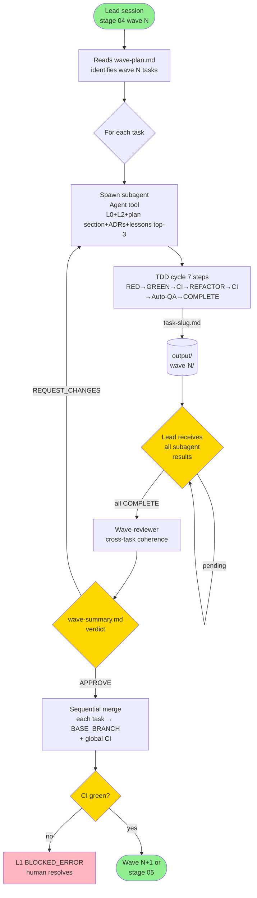

# Subagent Protocol

> **Version:** v3.1.0 (updated v3.12.1 — worktree model rewrite)
> **Skill:** `xp-icm-workflow`
> **Purpose:** Canonical doc of the subagent protocol used in stage 04 `implementation_waves`. Lead session orchestrates N subagents via Claude Code Agent tool, each executing one task of the wave in parallel. From v3.4.0: subagents spawned with `Agent(isolation: "worktree")` — harness creates an ephemeral worktree per task. Wave-reviewer (v3.5.0) spawned WITHOUT `isolation` — reads via `git show`/`git diff`.

> **Origin decision:** Q2/Q7/Q17 + §4.2-4.4 of the plan, simplified in v3.1 to use native Agent tool instead of worktrees + custom mailbox.

> **Single source of truth for the 14-step pipeline:** `references/wave-execution-protocol.md` (v3.12.1). This doc covers specific details of subagent dispatch (cap by tier, subagent-driven-development pattern). Cross-refs avoid duplication.

---

## 1. When to use subagents (vs single sequential session)

Subagent cap per wave per **tier** (Q17):

| Tier | Cap |
|---|---|
| experimental | 2 |
| tool | 3 |
| development | 5 |
| production | 5 |

**Skip subagents** (run sequential single-agent in stage 04) when:

- `tier=experimental` AND ≤2 tasks in the wave.
- `tier=tool` AND 1 task in the wave.
- `profile=experiment` (override by the matrix).

Mechanism per stage (plan §4.2):

| Stages | Mechanism |
|---|---|
| 00-3 (recon, discovery, design, wave_planner) | Single human-Claude session |
| 04 (implementation_waves) | **Subagents via Agent tool** (2-5 per wave) |
| 05-7 (verification, review, merge) | Single session or simple subagent |
| 08 (feedback intake) | Single manual session |

Profile may override cap (Q17 D''') — `framework_library` and `ml_project` cap=3.

---

## 2. Subagent spawn by lead

Lead session in stage 04:

1. Reads `stages/03_wave_planner/output/wave-plan.md` (generated by stage 03).
2. Identifies current wave (`L1.waves.current`).
3. For each task in the wave: spawns subagent via `Agent` tool with prompt containing pre-selected context.

### 2.1 Subagent prompt contract

Lead injects into the Agent tool prompt:

- L0 (`workspaces/{{WORKSPACE}}/CLAUDE.md`).
- L2 of stage 04 (`workspaces/{{WORKSPACE}}/stages/04_implementation_waves/CONTEXT.md`).
- Task section in `plan.md` (4-block + metadata).
- ADRs listed in `Files touched` of the task.
- Pre-extracted critical lessons (top-3 via Q10 match, severity desc).
- `4-block-contract-template.md` (canonical TDD 7-step cycle).
- **Mandatory branch setup** (§2.4 below).

Subagent does **NOT** read raw `lessons.md` — lead pre-processes it (§4.11 plan).

### 2.4 Branch verification (mandatory on startup)

The branch was already created by the lead. The harness already created the worktree. The subagent MUST verify, not create:

```
BRANCH VERIFICATION (execute FIRST, before any edit):
1. git branch --show-current
   Must show: wave-{{WORKSPACE_NUM}}-{{WAVE_N}}/{{TASK_SLUG}}
2. If it does NOT show the correct branch, STOP and report error.
   Do NOT run git checkout or git checkout -b — branch already exists.
3. git status --short → confirm clean working tree (no stray files from harness)
```

Subagent MUST verify the branch before any `Write`, `Edit`, or `Bash` that modifies files. If verification fails, subagent STOPS and reports `Status: BLOCKED` in the task output.

The lead pre-creates the branch (step 2.1) and the harness handles worktree setup. The subagent never runs `git checkout` or `git checkout -b` itself.

### 2.2 Isolation (v3.4+ worktree model)

Subagents run in **ephemeral worktrees** created by the harness via `Agent(isolation: "worktree")`. The subagent's CWD is the worktree directory (not `{{PROJECT_ROOT}}`). The worktree is checked out on the task branch `wave-{{WORKSPACE_NUM}}-<N>/<task-slug>`.

**CRITICAL — do NOT bleed into main worktree:** the subagent MUST NOT write to `{{PROJECT_ROOT}}` via absolute paths. All edits happen within the worktree. The worktree boundary provides git isolation but does not prevent the subagent from using absolute paths — this is a behavioral rule, not a technical guarantee. Violating it corrupts state files (L0/L1/L2) on the workspace branch.

**Branch is pre-created by the lead** before Agent spawn (§2.1 step 1). The harness does `git worktree add` pointing to the already-existing branch. The subagent does NOT create its own branch and does NOT run `git checkout`. The subagent verifies its branch with `git branch --show-current` on startup — it must show `wave-{{WORKSPACE_NUM}}-<N>/<task-slug>`. If the branch is wrong, the subagent STOPS and reports `Status: BLOCKED`.

For tasks that modify the same files, the lead **MUST** place them in different waves (see wave-planner-algorithm.md §5 dependency detection). The worktree model prevents file-level conflicts between parallel subagents.

### 2.3 Branches

Subagents work on dedicated branches per task:

- Branch: `wave-{{WORKSPACE_NUM}}-<N>/<task-slug>` created from `{{BASE_BRANCH}}`
- After task completion, subagent commits on the task branch
- Lead merges/rebases completed branches back into `{{BASE_BRANCH}}` at the end of the wave

Workspace branch (`workspace/{{WORKSPACE}}`) remains only for state files — NEVER touches `src/`.

---

## 3. Coordination (no mailbox)

The subagent model eliminates the need for a custom mailbox. Coordination happens via:

1. **Lead waits for each subagent's result.** The Agent tool is synchronous per subagent — lead receives output directly.
2. **Task output.** Subagent writes `stages/04_implementation_waves/output/wave-<N>/task-<slug>.md` with complete report.
3. **Status in report.** Each `task-<slug>.md` ends with a `## Status` section containing `COMPLETE` or `BLOCKED`.

No mailbox files. No polling. Lead calls Agent tool and receives result.

---

## 4. Wave-reviewer

After all wave subagents complete, lead spawns **1 dedicated subagent** `wave-reviewer-<N>` for cross-task coherence check.

Wave-reviewer does **NOT** revalidate code of each task (that already passed auto-QA §6 of the TDD cycle). Verifies:

- Outputs declared in `Files touched` of each task **exist** in the final wave merge.
- Inter-task dependencies work (smoke test between wave modules).
- Consistent conventions across tasks (naming, patterns, error handling).

Output: `output/wave-<N>/wave-summary.md`.

Verdict: `APPROVE` | `REQUEST_CHANGES`.

### 4.1 Skip exception (F2)

A wave with **1 task** skips the wave-reviewer. Global CI covers. Documented in `wave-planner-algorithm.md`.

---

## 5. Sequential merge

After wave-reviewer `APPROVE`, lead executes merge in topological task order:

```bash
# PREREQUISITE: lead is on workspace/{{WORKSPACE}} branch
# Save working tree state before leaving
_stashed=0
if ! git diff --quiet || ! git diff --cached --quiet; then
    git stash --include-untracked -m "icm-merge-preflight"
    _stashed=1
fi

for task in wave.tasks_independency_order:
    git checkout {{BASE_BRANCH}}
    git merge wave-{{WORKSPACE_NUM}}-<N>/<task-slug> --no-ff

    # Global CI gate
    if ci_fails:
        git merge --abort
        # RETURN to workspace branch BEFORE reporting error
        git checkout workspace/{{WORKSPACE}}
        if _stashed; then git stash pop; fi
        L1.status = "BLOCKED_ERROR"
        L1.blocked_at_sub_wave = N
        L1.blocked_task = task.slug
        # escalate to human — stop
        return

# RETURN to workspace branch after all merges
git checkout workspace/{{WORKSPACE}}
if _stashed; then git stash pop; fi
```

Merge conflict = human resolves (no auto-solve). Lead resumes from blocked task in a future session.

**Anti-pattern:** DO NOT remain on `{{BASE_BRANCH}}` after merge. Lead MUST return to `workspace/{{WORKSPACE}}` before any state operation (L1 update, kickoff, handoff commit). Workspace hooks only validate correctly on the workspace branch.

### 5.1 Post-merge cleanup (v3.4.3)

After sequential merge + global CI gate green, lead MUST remove ephemeral worktrees (created by Agent tool with `isolation: "worktree"`) AND delete already-merged branches:

```bash
# For each task in the wave (paths captured from Agent tool results):
git worktree remove <path-returned-by-Agent-tool>
git branch -d wave-{{WORKSPACE_NUM}}-<N>/<task-slug>   # already merged --no-ff
```

Bug pre-v3.4.3: absent cleanup made worktrees accumulate in `<project_root>/.icm-wave-*` + stale branches in `git branch` listing. Can cause confusion in `git worktree list` and degrade performance across multiple waves.

Non-fatal failure — lead records warning in `wave-summary.md` but proceeds. `git branch -d` refuses unmerged branch (intentional); do not use `-D` (masks bugs). Recovery Wizard `WAVE_WORKTREE_ORPHAN` covers buggy workspaces.

---

## 6. Global CI between waves

Wave N+1 only starts after:

1. Wave N entirely merged into `{{BASE_BRANCH}}`.
2. Global CI green (integrated tests — not just per-task).

Pre-flight check for the next wave validates both items.

---

## 7. Mid-wave reduce (D'')

Lead may end a wave partially when drift is observed. Triggers:

- **Stuck cycles:** subagent failed 3× in the TDD cycle (auto-QA failing 3×).
- **Timeout:** subagent did not complete in reasonable time.
- **Budget growing:** tokens consumed > 2× estimate.

### 7.1 Action

1. Lead ends partial wave: tasks already COMPLETE remain; incomplete tasks become `BLOCKED`.
2. Snapshot for human in `output/wave-<N>/mid-wave-reduce.md`.
3. Lead updates L1:
   - `status: BLOCKED_ERROR`
   - `last_action: "mid-wave reduce — N subagents terminated early"`

### 7.2 Human decision

Human chooses (menu A/B/C):

- **(A)** continue with remaining tasks in next sub-wave.
- **(B)** rethink `plan.md` (returns to stage 02).
- **(C)** abort entire wave.

---

## 8. Peer-reviewer ad-hoc (F-A, tier=production)

For tasks with `Requires_peer_review: true`, lead spawns an additional subagent `peer-reviewer-<slug>` AFTER the main subagent signals COMPLETE.

### 8.1 Triggers

- Critical path (defined in `plan.md` per task: `Requires_peer_review: true`).
- 3 stuck cycles in the main subagent (cap reached).
- Tier=production always (default).

### 8.2 Flow

1. Lead spawns subagent `peer-reviewer-<slug>` via Agent tool.
2. Peer-reviewer reads `output/wave-<N>/task-<slug>.md` (main subagent report).
3. Does review focused on **correctness**, **security**, **perf**.
4. Writes `output/wave-<N>/peer-review-<slug>.md`.
5. Verdict:
   - `APPROVE` → lead proceeds with merge.
   - `REQUEST_FIX` → main subagent enters a **new cycle** (cap 3 still applies).

---

## 9. Synchronous-first workflow

**Default rule:** subagents prefer synchronous tools (Bash without
`run_in_background`, pytest direct, ruff direct) when expected duration
<5min. Async (`Bash run_in_background=true` + `Monitor`) reserved for
long processes: dev server, build watch, deploy, tests >5min.

**Why:** subagents have difficulty knowing when to return after
Monitor — wave 6 session-recurrence incident: subagent invoked Monitor
to wait for 14s pytest, got confused about completion, exited without
`git commit`. Cause: async overhead not justified for short duration.

**Concrete anti-pattern:**

```
# ANTI-PATTERN (wave 6 incident):
Bash run_in_background=true: "pytest tests/ > /tmp/out.log"
Monitor "until grep passed /tmp/out.log; do sleep 5; done"

# CORRECT:
Bash: "pytest tests/" (synchronous, blocks, returns exit code)
```

---

## 10. Target token budget

Reference (no automatic enforcement — see Q19):

| Role | Typical tokens |
|---|---|
| Lead (orchestration) | ~1k |
| Subagent (each) | ~5-8k |
| Wave-reviewer | ~3k |
| Peer-reviewer (ad-hoc) | ~3k |

Wave of 5 subagents ≈ 30-50k tok total. `>2× estimate` triggers mid-wave reduce (§7).

---

## 11. Flow diagram



---

## 12. Cross-references

| Doc | Related content |
|---|---|
| `references/4-block-contract-template.md` | TDD 7-step cycle per subagent, auto-QA 15-item, cap 3 |
| `references/wave-planner-algorithm.md` | DAG, sub-waves (E3), Q10 lesson match, Q6 peer-review trigger |
| `references/stage-templates.md` | L2 of stage 04 `implementation_waves` (Inputs/Outputs) |
| `references/state-machine-schema.md` | Canonical L1 statuses (BLOCKED_ERROR, RESTARTING_AT_PHASE_X) |
| `references/stop-points-canonical.md` | 12 stop points + escalation |
| `references/recovery-wizard.md` | Recovery if lead crashed mid-wave |
| `templates/workspace/CLAUDE.md.tpl` | L0 — workspace immutable identity |
---

## v3.3.0 — AGENT-BRIEF format (refactor §2.1)

From v3.3.0 onwards, the context injection (§2.1) is structured as
**AGENT-BRIEF** (canonical format in
`<workspace>/_references/runtime/agent-brief-template.md`).

Lead session uses the deterministic CLI to generate the brief:

```bash
python {{SKILL_DIR}}/scripts/agent-brief-render.py \
    --task <slug> \
    --plan stages/02_design/output/plan.md \
    --adrs {{PROJECT_ROOT}}/docs/decisions
```

Output (markdown) is injected into the Agent tool prompt along with:
- L0 (`workspaces/{{WORKSPACE}}/CLAUDE.md`)
- L2 (`workspaces/{{WORKSPACE}}/stages/04_implementation_waves/CONTEXT.md`)
- L3 ubiquitous language (`_config/CONTEXT.md`)
- 4-block-contract-template + top-3 lessons + mandatory branch setup

**Anti-patterns detected by render:** absolute paths in acceptance
criteria, line numbers — generate warnings (and exit 1 if `--strict`). Brief
must be **behavioral** (durability over precision), not procedural.

**HITL handling:** if task is `Type: HITL`, lead does **NOT** spawn subagent.
Generates AGENT-BRIEF, displays to human, updates L1
`status=COMPLETED_AWAITING_HUMAN, sub_stage=04_wave_N_hitl_pending`,
EXIT. Next session (after human resolves) resumes.

Mapping 4-block ↔ AGENT-BRIEF:
- WHAT → Summary + Desired behavior
- HOW → Key interfaces (no paths)
- OUT OF SCOPE → Out of scope
- VALIDATION → Acceptance criteria
