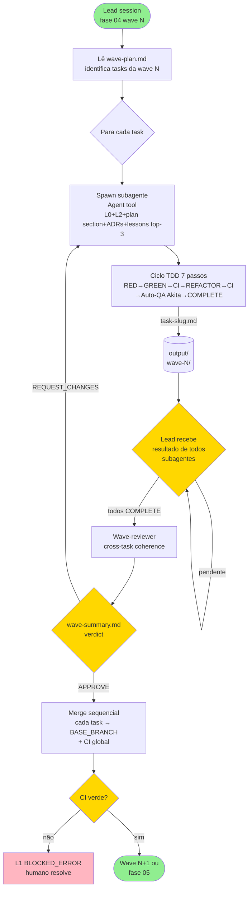

# Subagent Protocol

> **Versão:** v3.1.0
> **Skill:** `xp-icm-workflow`
> **Propósito:** Doc canônico do protocolo de subagentes usado na fase 04 `implementation_waves`. Lead session orquestra N subagentes via Claude Code Agent tool, cada um executando uma task da wave em paralelo. Sem git worktrees, sem mailbox custom, sem sync barrier manual. O Agent tool fornece isolamento de contexto.

> **Decisão de origem:** Q2/Q7/Q17 + §4.2-4.4 do plan, simplificado em v3.1 para usar Agent tool nativo em vez de worktrees + mailbox.

---

## 1. Quando usar subagentes (vs sessão única sequencial)

Cap de subagentes por wave por **tier** (Q17):

| Tier | Cap |
|---|---|
| experimental | 2 |
| tool | 3 |
| development | 5 |
| production | 5 |

**Skip subagentes** (rodar sequencial single-agent na fase 04) quando:

- `tier=experimental` E ≤2 tasks na wave.
- `tier=tool` E 1 task na wave.
- `profile=experiment` (override pela matriz).

Mecanismo por fase (plan §4.2):

| Fases | Mecanismo |
|---|---|
| 00-3 (recon, discovery, design, wave_planner) | Sessão única humano-Claude |
| 04 (implementation_waves) | **Subagentes via Agent tool** (2-5 por wave) |
| 05-7 (verification, review, merge) | Sessão única ou subagente simples |
| 08 (feedback intake) | Sessão única manual |

Profile pode override cap (Q17 D''') — `framework_library` e `ml_project` cap=3.

---

## 2. Spawn de subagentes pelo lead

Lead session na fase 04:

1. Lê `stages/03_wave_planner/output/wave-plan.md` (gerado pela fase 03).
2. Identifica wave atual (`L1.waves.current`).
3. Para cada task da wave: spawn subagente via `Agent` tool com prompt contendo contexto pré-selecionado.

### 2.1 Contrato de prompt do subagente

Lead injeta no prompt do Agent tool:

- L0 (`workspaces/{{WORKSPACE}}/CLAUDE.md`).
- L2 da fase 04 (`workspaces/{{WORKSPACE}}/stages/04_implementation_waves/CONTEXT.md`).
- Seção da task no `plan.md` (4-block + metadados).
- ADRs listados em `Files touched` da task.
- Lições críticas pré-extraídas (top-3 via Q10 match, severity desc).
- `4-block-contract-template.md` (ciclo TDD 7 passos canônico).
- **Branch setup obrigatório** (§2.4 abaixo).

Subagente **NÃO** lê `lessons.md` cru — lead pré-cozinha (§4.11 plan).

### 2.4 Branch setup (obrigatório no prompt)

Lead DEVE incluir no prompt do subagente instruções explícitas de branch:

```
BRANCH SETUP (execute PRIMEIRO, antes de qualquer edição):
1. git checkout {{BASE_BRANCH}}
2. git checkout -b wave-{{WORKSPACE_NUM}}-{{WAVE_N}}/{{TASK_SLUG}}
3. Confirme com: git branch --show-current
   Deve mostrar: wave-{{WORKSPACE_NUM}}-{{WAVE_N}}/{{TASK_SLUG}}
4. Se NÃO mostrar a branch correta, PARE e reporte erro.
```

Subagente DEVE executar o branch setup antes de qualquer `Write`, `Edit`, ou `Bash` que modifique arquivos. Se o checkout falhar, o subagente PARA e reporta o erro no output da task com `Status: BLOCKED`.

Lead NÃO assume que o Agent tool herda a branch correta — o subagente roda em contexto isolado e precisa estabelecer seu próprio branch.

### 2.2 Isolamento

Cada subagente roda em contexto isolado (Agent tool). O subagente trabalha na mesma branch do workspace (`workspace/{{WORKSPACE}}`). Se houver conflito potencial entre subagentes em arquivos diferentes, o lead pode agrupar tasks conflitantes na mesma wave ou sequentialmente.

Para tasks que modificam os mesmos arquivos, o lead **DEVE** colocá-las em waves diferentes (vide wave-planner-algorithm.md §5 dependency detection).

### 2.3 Branches

Subagentes trabalham em branches dedicadas por task:

- Branch: `wave-{{WORKSPACE_NUM}}-<N>/<task-slug>` criada de `{{BASE_BRANCH}}`
- Após conclusão da task, o subagente faz commit na branch da task
- Lead faz merge/rebase das branches completas de volta em `{{BASE_BRANCH}}` ao fim da wave

Branch do workspace (`workspace/{{WORKSPACE}}`) continua só para state files — NUNCA toca `src/`.

---

## 3. Coordenação (sem mailbox)

O modelo de subagentes elimina a necessidade de mailbox custom. Coordenação acontece via:

1. **Lead espera resultado de cada subagente.** O Agent tool é síncrono por subagente — lead recebe o output direto.
2. **Output da task.** Subagente escreve `stages/04_implementation_waves/output/wave-<N>/task-<slug>.md` com relatório completo.
3. **Status no relatório.** Cada `task-<slug>.md` termina com seção `## Status` contendo `COMPLETE` ou `BLOCKED`.

Sem arquivos de mailbox. Sem polling. O lead chama Agent tool e recebe o resultado.

---

## 4. Wave-reviewer

Após todos subagentes da wave completarem, lead spawn **1 subagente dedicado** `wave-reviewer-<N>` para cross-task coherence check.

Wave-reviewer **NÃO** revalida código de cada task (isso já passou no auto-QA Akita §6 do TDD ciclo). Verifica:

- Outputs declarados em `Files touched` de cada task **existem** no merge final da wave.
- Inter-task dependencies funcionam (smoke test entre módulos da wave).
- Conventions consistentes entre tasks (naming, padrões, error handling).

Output: `output/wave-<N>/wave-summary.md`.

Verdict: `APPROVE` | `REQUEST_CHANGES`.

### 4.1 Skip exception (F2)

Wave com **1 task** pula wave-reviewer. CI global cobre. Documentado em `wave-planner-algorithm.md`.

---

## 5. Merge sequencial

Após wave-reviewer `APPROVE`, lead executa merge em ordem topológica das tasks:

```bash
# PRÉ-REQUISITO: lead está em workspace/{{WORKSPACE}} branch
# Salvar state de working tree antes de sair
_stashed=0
if ! git diff --quiet || ! git diff --cached --quiet; then
    git stash --include-untracked -m "icm-merge-preflight"
    _stashed=1
fi

for task in wave.tasks_independency_order:
    git checkout {{BASE_BRANCH}}
    git merge wave-{{WORKSPACE_NUM}}-<N>/<task-slug> --no-ff

    # CI gate global
    if ci_fails:
        git merge --abort
        # VOLTAR pra workspace branch ANTES de reportar erro
        git checkout workspace/{{WORKSPACE}}
        if _stashed; then git stash pop; fi
        L1.status = "BLOCKED_ERROR"
        L1.blocked_at_sub_wave = N
        L1.blocked_task = task.slug
        # escala humano — para
        return

# VOLTAR pra workspace branch após todos os merges
git checkout workspace/{{WORKSPACE}}
if _stashed; then git stash pop; fi
```

Conflito de merge = humano resolve (não auto-solve). Lead retoma do task bloqueado em sessão futura.

**Anti-pattern:** NÃO permanecer em `{{BASE_BRANCH}}` após merge. Lead DEVE voltar para `workspace/{{WORKSPACE}}` antes de qualquer operação de state (L1 update, kickoff, commit de handoff). Hooks de workspace só validam corretamente na branch workspace.

---

## 6. CI global entre waves

Wave N+1 só inicia após:

1. Wave N inteiramente mergeada em `{{BASE_BRANCH}}`.
2. CI global verde (testes integrados — não só por-task).

Pre-flight check da próxima wave valida os 2 itens.

---

## 7. Mid-wave reduce (D'')

Lead pode encerrar wave parcialmente quando observa drift. Triggers:

- **Ciclos travados:** subagente falhou 3× no ciclo TDD (auto-QA Akita falhando 3×).
- **Timeout:** subagente não completou em tempo razoável.
- **Orçamento crescendo:** tokens consumidos > 2× estimativa.

### 7.1 Ação

1. Lead encerra wave parcial: tasks já COMPLETE permanecem; tasks não-completas viram `BLOCKED`.
2. Snapshot para humano em `output/wave-<N>/mid-wave-reduce.md`.
3. Lead atualiza L1:
   - `status: BLOCKED_ERROR`
   - `last_action: "mid-wave reduce — N subagentes encerrados precocemente"`

### 7.2 Decisão humana

Humano escolhe (menu A/B/C):

- **(A)** continuar com tasks restantes em sub-wave seguinte.
- **(B)** repensar `plan.md` (volta fase 02).
- **(C)** abortar wave inteira.

---

## 8. Peer-reviewer ad-hoc (F-A, tier=production)

Para tasks `Requires_peer_review: true`, lead spawn subagente adicional `peer-reviewer-<slug>` APÓS o subagente principal sinalizar COMPLETE.

### 8.1 Triggers

- Path crítico (definido em `plan.md` por task: `Requires_peer_review: true`).
- 3 ciclos travados no subagente principal (cap atingido).
- Tier=production sempre (default).

### 8.2 Fluxo

1. Lead spawn subagente `peer-reviewer-<slug>` via Agent tool.
2. Peer-reviewer lê `output/wave-<N>/task-<slug>.md` (relatório do subagente principal).
3. Faz review focada em **correctness**, **security**, **perf**.
4. Escreve `output/wave-<N>/peer-review-<slug>.md`.
5. Verdict:
   - `APPROVE` → lead procede merge.
   - `REQUEST_FIX` → subagente principal entra em **novo ciclo** (cap 3 ainda vigente).

---

## 9. Token budget alvo

Referência (sem enforcement automático — vide Q19):

| Papel | Tokens típicos |
|---|---|
| Lead (orquestração) | ~1k |
| Subagente (cada) | ~5-8k |
| Wave-reviewer | ~3k |
| Peer-reviewer (ad-hoc) | ~3k |

Wave de 5 subagentes ≈ 30-50k tok totais. `>2× estimativa` dispara mid-wave reduce (§7).

---

## 10. Diagrama de fluxo



---

## 11. Referências cruzadas

| Doc | Conteúdo relacionado |
|---|---|
| `references/4-block-contract-template.md` | Ciclo TDD 7 passos por subagente, auto-QA Akita 15-item, cap 3 |
| `references/wave-planner-algorithm.md` | DAG, sub-waves (E3), Q10 lesson match, Q6 peer-review trigger |
| `references/stage-templates.md` | L2 da fase 04 `implementation_waves` (Inputs/Outputs) |
| `references/state-machine-schema.md` | L1 status canônicos (BLOCKED_ERROR, RESTARTING_AT_PHASE_X) |
| `references/stop-points-canonical.md` | 12 stop points + escalonamento |
| `references/recovery-wizard.md` | Recuperação se lead crashou mid-wave |
| `templates/workspace/CLAUDE.md.tpl` | L0 — identidade imutável do workspace |
---

## v3.3.0 — AGENT-BRIEF format (refactor §2.1)

A partir de v3.3.0, o context injection (§2.1) é estruturado como
**AGENT-BRIEF** (formato canônico em
`<workspace>/_references/runtime/agent-brief-template.md`).

Lead session usa CLI determinístico para gerar brief:

```bash
python {{SKILL_DIR}}/scripts/agent-brief-render.py \
    --task <slug> \
    --plan stages/02_design/output/plan.md \
    --adrs {{PROJECT_ROOT}}/docs/decisions
```

Output (markdown) é injetado no prompt do Agent tool junto com:
- L0 (`workspaces/{{WORKSPACE}}/CLAUDE.md`)
- L2 (`workspaces/{{WORKSPACE}}/stages/04_implementation_waves/CONTEXT.md`)
- L3 ubiquitous language (`_config/CONTEXT.md`)
- 4-block-contract-template + lições top-3 + branch setup obrigatório

**Anti-patterns detectados pelo render:** paths absolutos em acceptance
criteria, line numbers — geram warnings (e exit 1 se `--strict`). Brief
deve ser **comportamental** (durability over precision), não procedimental.

**HITL handling:** se task é `Type: HITL`, lead **NÃO** spawna subagent.
Gera AGENT-BRIEF, exibe ao humano, atualiza L1
`status=COMPLETED_AWAITING_HUMAN, sub_stage=04_wave_N_hitl_pending`,
SAIR. Próxima sessão (após humano resolver) retoma.

Mapping 4-block ↔ AGENT-BRIEF:
- O QUE → Summary + Desired behavior
- COMO → Key interfaces (sem paths)
- NÃO QUERO → Out of scope
- VALIDAÇÃO → Acceptance criteria
